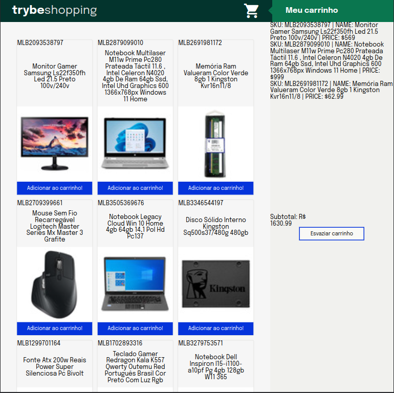

# Trybe-Project-Shopping-Cart

Project developed in the front-end module at trybe

## Description

In this project, a fully dynamic shopping cart was developed. Thus consuming data directly from an API (Mercado Livre).

The development of this project was using TDD, so the project has its lines 100% covered by unit tests.

## Skills developed

- Test driven development (TDD)
- Manipulate the `jest`
- Unit tests

## Preview

